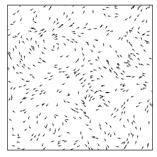

# activematter-python

[Active Matter Simulation](https://medium.com/swlh/create-your-own-active-matter-simulation-with-python-76fce4a53b6f)

## Create Your Own Active Matter Simulation (With Python)

### Philip Mocz (2021) Princeton Univeristy

Simulate Active Matter: Viscek Model for Flocking Birds

'''
python activematter.py
'''

